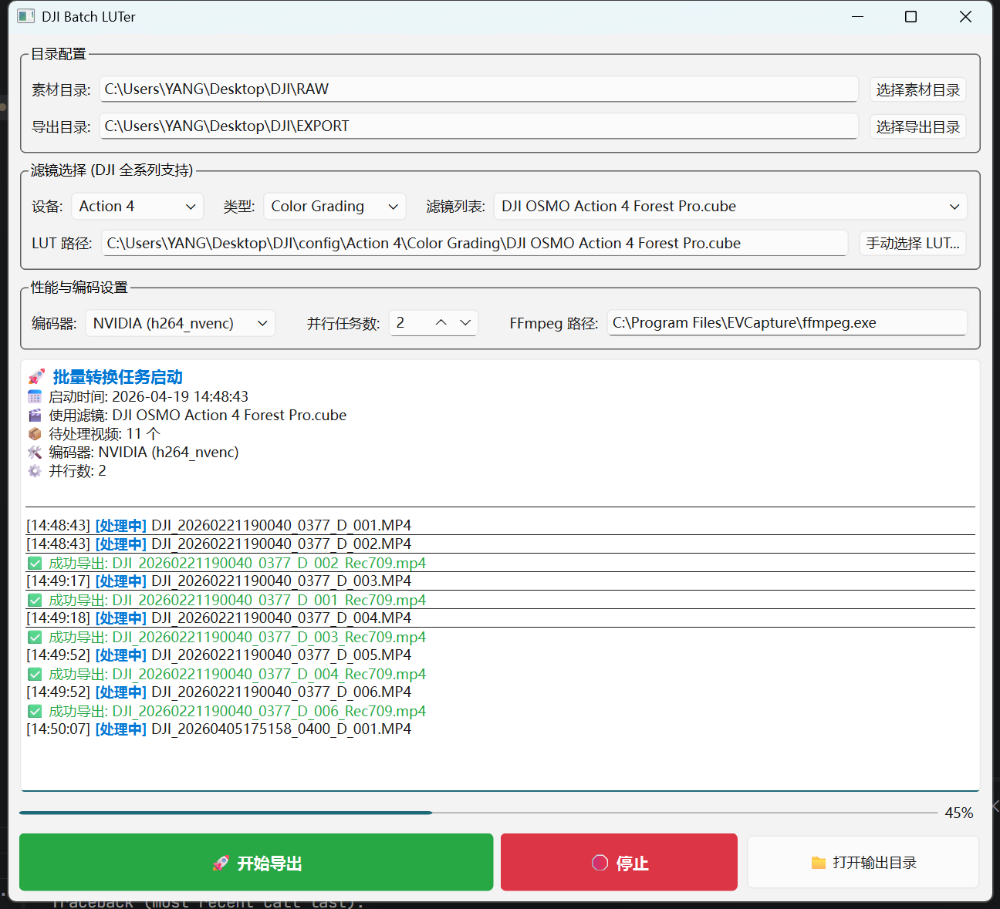

# DJI Batch LUTer

这是一个专门为大疆 (DJI) 全系列设备开发的视频批量转换工具。它可以将 Action、Mavic、Air 等系列录制的 D-Log / D-Log M 原始素材，通过官方 LUT 快速还原为标准 Rec.709 色彩，并支持应用各类官方特定的调色滤镜。



## 🌟 核心功能

- **DJI 全系列色彩还原**:
  - **Action 系列**: 支持 Action 4/5 Pro 等 D-Log M 还原。
  - **无人机系列**: 支持 Mavic、Air、Mini 等系列的 D-Log / D-Log M 色彩还原。
- **官方调色滤镜支持**: 支持加载 DJI 官方发布的各类风格化调色滤镜（如 Forest, Ice, Nature 等）。
- **智能滤镜库管理**: 自动扫描 `config/` 目录，按设备系列（Action, Mavic, Air 等）和功能（还原/调色）自动分类。
- **全硬件加速**: 支持 NVIDIA (NVENC)、Intel (QSV) 和 AMD (AMF) 显卡加速，实现极速导出。
- **并行处理**: 支持多任务同时并行转换，充分发挥硬件性能。
- **配置持久化**: 自动记忆路径设置、选中的设备、滤镜以及编码器偏好。
- **图形界面**: 简单易用的 PyQt6 交互界面，实时显示处理日志和进度。

## 📋 支持列表

| 设备系列                     | 还原滤镜 (Normalization) | 调色滤镜 (Color Grading)  | 说明                  |
| :----------------------- | :------------------- | :-------------------- | :------------------ |
| **Osmo Action 4** 📸     | ✅ D-Log M to Rec.709 | ✅ Forest, Ice, Nature | 全系列官方调色支持           |
| **Osmo Action 5 Pro** 📸 | ✅ D-Log M to Rec.709 | ✅ Ju, Lan, Mei, Zhu   | 最新 Pro 系列滤镜支持       |
| **Mavic 3 系列** 🛸        | ✅ D-Log, D-Log M     | -                     | 包含标准及 Vivid 还原      |
| **Mavic 4 Pro** 🛸       | ✅ D-Log, D-Log M     | -                     | 包含标准及 Vivid 还原      |
| **其他设备** 📁              | 自动识别子目录              | 自动识别子目录               | 支持通过 `config/` 目录扩展 |

## 📂 项目结构

```text
DJI/
├── config/               # 存放 DJI 官方及自定义 LUT 文件 (*.cube)
│   ├── Action 4/         # 按设备系列分类
│   │   ├── Normalization/ # 还原滤镜 (如 D-Log M to Rec.709)
│   │   └── Color Grading/ # 调色滤镜
│   ├── Action 5 Pro/
│   └── Mavic 3/          # 其他设备系列...
├── doc/                  # 项目详细文档
│   └── hardware_acceleration.md # 硬件加速指南
├── src/
│   └── DJI_Batch_LUTer.py # 图形界面主程序 (推荐使用)
├── RAW/                  # 默认原始素材存放目录
├── EXPORT/               # 默认导出视频存放目录
├── README.md             # 项目说明文档
├── requirements.txt      # Python 依赖包列表
└── dji_luter_config.json # 自动生成的配置文件 (记住用户设置)
```

## 📖 详细文档

更多关于本工具的使用细节，请参阅：

- [硬件加速指南](doc/hardware_acceleration.md)

## 🚀 快速开始

### 1. 环境准备

确保你的电脑已安装：

- **Python 3.10+**
- **FFmpeg**: 建议将 `ffmpeg.exe` 添加到系统环境变量中。本工具也会自动尝试定位本地已安装的 FFmpeg。

### 2. 安装依赖

在项目根目录下运行：

```bash
pip install -r requirements.txt
```

### 3. 运行程序

```bash
python src/DJI_Batch_LUTer.py
```

## 🛠️ 使用说明

1. **选择素材**: 将视频放入 `RAW` 目录，或点击按钮手动选择目录。
2. **选择设备与滤镜**:
   - 在“设备”下拉框选择你的相机型号（如 Action 5 Pro）。
   - 在“类型”下拉框选择“还原”或“调色”。
   - 在“滤镜列表”中选择具体的滤镜文件。
   - 也支持点击“手动选择 LUT”来加载任何外部 `.cube` 文件。
3. **设置并发**: 建议显卡加速时设为 1-2，纯 CPU 模式可设为 CPU 核心数。
4. **开始导出**: 点击按钮，等待进度条走完。

## 📝 注意事项

- 如果处理失败，请检查 FFmpeg 路径是否正确。
- 本工具已针对 10-bit 素材做了 8-bit 编码兼容性优化。
- 建议定期将最新的官方 LUT 文件放入 `assets/luts` 目录以获得最佳支持。

